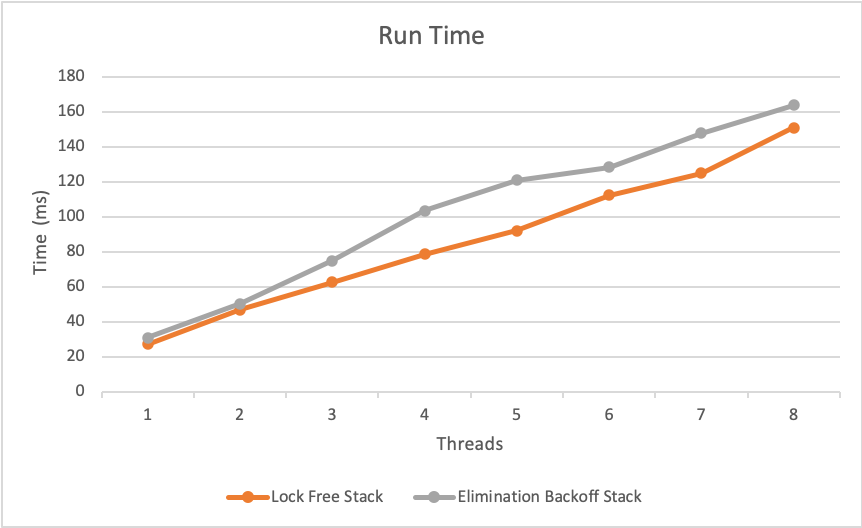
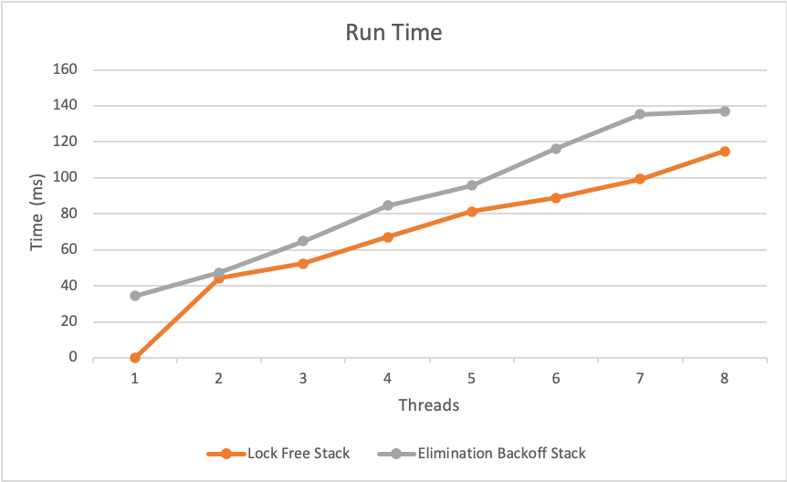
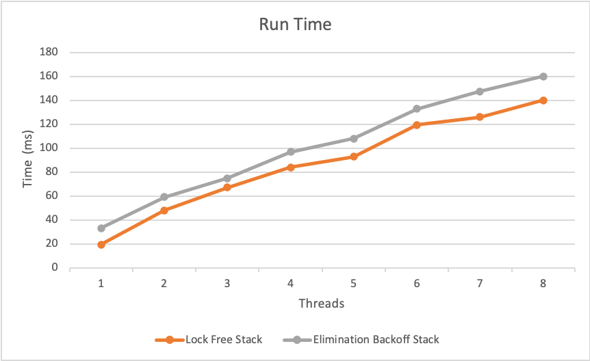

# LockFree Stack

## How To Run

### Compile

    javac EliminationBackoffStack.java LockFreeStack.java Runner.java Main.java

### Run

    java Main

### Parameters

In main.java, change any of the int variables to vary the run
The ratio variables should add up to 100

The Runner.run function is a single run of a given STACK_TYPE (either *Runner.STACK_TYPE.{ELIM_STACK,LOCK_STACK}*)

The Runner.one_to_n_threads function runs both stacks for the given inputs from 1 to n threads. It can either be random or ratio based (*Runner.RUN_TYPE.{RAND,RATIO}*). If using ratios the three values should add up to 100, and be divisible by*OPS_PER_THREAD*.

Note that using this function allows the stacks to warm up and give faster speed times

All results are printed in milliseconds

## Problem 1  - *LockFreeStack.java*

The stack was implemented by wrapping a simple Node\<T\> object around an AtomicReference. Each Node object has a next value that is a Node, and a value which is  T.
The push function simply makes a new Node with the value, and makes its next value point to the old head. Then it performs a compare and set on the head Node to replace it with the new one.

Similarly the pop function takes the head node next value and makes it the new head and returns the old head when successful.

This is merely a lock free implementation as it does not provide any wait free guarantees. No backoff method was implemented on this version of the stack, so it relies on having a *while(true)* loop to eventually get a compare and set done.
In regards to the numOps counter, it had originally been kept as an int and incremented between threads but this was giving inconsistent results, it was unclear whether or not this was supposed to be replaced too with an atomic counter but it was done in order to maintain consistency.

## Problem 2 - EliminationBackoffStack.java

This implementation is wait free, it uses the Backoff method outlined in chapter 7 of the book. On each push or pop it calls a tryPop and tryPush method which uses a RangePolicy as a sort of timeout to guarantee a the function from locking up. In the case that it can't successfully do a push or a pop the call gets put into an array of sorts called EliminationArray in which then another thread can come in a finish off the previous functions before it can complete its own.

The linearization point occurs on the tryPop and tryPush function, at the same time when the numOps is getting incremented. For tryPop it is when the value is compare and set with the changed head pointer and for tryPush it is when the head pointer gets assigned to the new value. Since each operation has a time limit this is wait free. Liveness is guaranteed by having the array of operations which ensures that there will be operations performed by each thread and it will not starve.

## Benchmarks

### Testing Environment

- macOS Big Sur
- Intel i5-7360U (2 cores/4 threads) @ 2.30GHz
- 8gb RAM
- Java 11

### Problem 1

| Type | Lock Free Stack |
|--|--|
| Threads | 8 |
| Operations | 150000 |
| Preallocate | 50000 |
| Operation Distribution | Random |

On average the execution time for the given configuration was **115 ms**

### Problem 2

#### Test 1

| Operation | Ratio |
|--|--|
| Push | 1/3 |
| Pop | 1/3 |
| Size | 1/3 |  
  

#### Test 2

| Operation | Ratio |
|--|--|
| Push | 2/4 |
| Pop | 1/4 |
| Size | 1/4 |  

#### Test 3

| Operation | Ratio |
|--|--|
| Push | 3/6 |
| Pop | 2/6 |
| Size | 1/6 |  

#### Analysis

I had thought that the more complicated wait free implementation would yield much better results than the much more simpler lock free version was. It consistently was slower in every run of when compared to the lock free. I believe this is due to the overhead of having the other objecs such as the list used. I believe that with more contention between the threads where there were more complicated operations being performed the waitfree guarantee might be enough to be more efficient than the lock free stack.
It would have been interesting to implement the lock based stack and compare it between the other two data structures to compare the performance and further scale up the number of operations and thread count. One thing to note that the machine in which these tests were run was a dual core, four thread cpu which would have a large effect as the thread count got further scaled up
